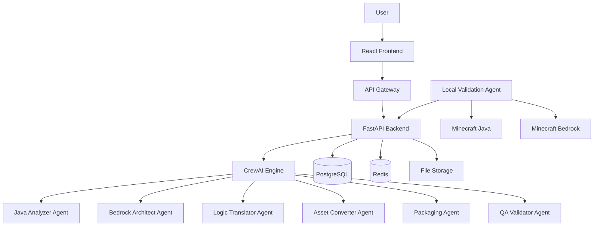
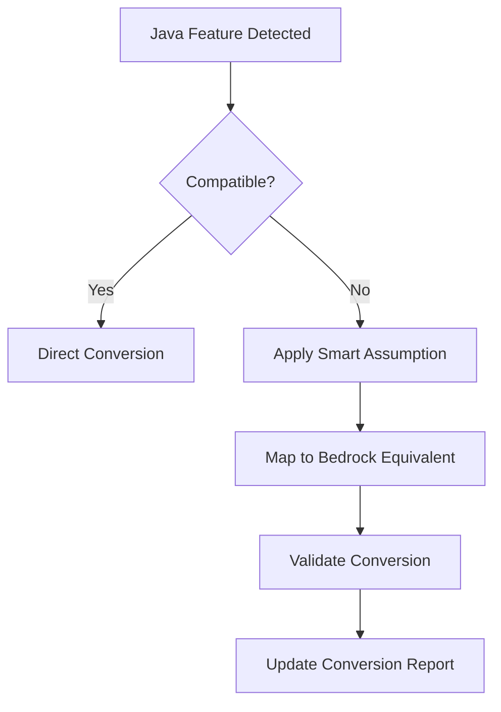

# ModPorter AI Architecture

## Overview

ModPorter AI follows a microservices architecture designed for scalability and maintainability, implementing the PRD requirements through specialized services.

## System Architecture



## Service Responsibilities

### Frontend (React + TypeScript)
**Purpose**: User interface implementing PRD visual learning requirements

**Key Components**:
- `ConversionUpload`: PRD Feature 1 implementation
- `ConversionReport`: PRD Feature 3 implementation  
- `ProgressTracker`: Real-time conversion status
- `SmartAssumptionsDisplay`: Visual explanation of AI decisions

**Technologies**: React 18, TypeScript, React Router, Axios

### Backend (FastAPI + Python)
**Purpose**: API orchestration and business logic coordination

**Key Responsibilities**:
- File upload handling and validation
- Conversion workflow coordination
- User session management
- Rate limiting and security

**Technologies**: FastAPI, Pydantic, SQLAlchemy, Redis

### AI Engine (CrewAI + LangChain)
**Purpose**: Core conversion intelligence implementing PRD Feature 2

**Agent Architecture**:
```
Java Analyzer → Bedrock Architect → Logic Translator
                      ↓
Asset Converter ← Packaging Agent ← QA Validator
```

**Technologies**: CrewAI, LangChain, OpenAI/Anthropic APIs

### Local Validation Agent (Node.js)
**Purpose**: PRD Feature 4 implementation for gameplay comparison

**Capabilities**:
- Minecraft launcher integration
- Automated gameplay testing
- Screenshot/video capture
- Comparison reporting

**Technologies**: Node.js, Puppeteer, Minecraft Protocol

## Data Flow

### Conversion Process
1. **Upload**: User uploads mod file via Frontend
2. **Validation**: Backend validates file and creates conversion task
3. **Analysis**: Java Analyzer Agent examines mod structure
4. **Planning**: Bedrock Architect applies smart assumptions
5. **Translation**: Logic Translator converts code
6. **Asset Processing**: Asset Converter handles resources
7. **Packaging**: Packaging Agent creates .mcaddon
8. **Validation**: QA Validator generates report
9. **Delivery**: User receives converted add-on

### Smart Assumptions Application


## Database Schema

### Core Tables
```sql
-- Conversion jobs tracking
CREATE TABLE conversions (
    id UUID PRIMARY KEY,
    status VARCHAR(50) NOT NULL,
    created_at TIMESTAMP DEFAULT NOW(),
    completed_at TIMESTAMP,
    user_id VARCHAR(100),
    original_filename VARCHAR(255),
    success_rate DECIMAL(5,2),
    error_message TEXT
);

-- Smart assumptions applied
CREATE TABLE applied_assumptions (
    id UUID PRIMARY KEY,
    conversion_id UUID REFERENCES conversions(id),
    assumption_type VARCHAR(100),
    original_feature VARCHAR(255),
    bedrock_equivalent VARCHAR(255),
    impact_level VARCHAR(20)
);

-- Conversion results
CREATE TABLE conversion_results (
    id UUID PRIMARY KEY,
    conversion_id UUID REFERENCES conversions(id),
    mod_name VARCHAR(255),
    status VARCHAR(50),
    features_converted INTEGER,
    features_failed INTEGER,
    download_url VARCHAR(500)
);
```

## Security Architecture

### File Processing Security
- Upload validation and sanitization
- Isolated processing containers
- Temporary file cleanup
- Malware scanning integration

### API Security
- JWT-based authentication
- Rate limiting per IP/user
- Input validation on all endpoints
- CORS configuration

### Data Protection
- No permanent storage of user mods
- Encrypted temporary storage
- Audit logging for all operations
- GDPR compliance for EU users

## Scalability Design

### Horizontal Scaling
- Stateless backend services
- Redis for session management
- PostgreSQL with read replicas
- CDN for static assets

### Load Management
- Conversion queue with Redis
- Background job processing
- Auto-scaling based on queue depth
- Circuit breakers for external APIs

### Performance Optimization
- Frontend code splitting
- API response caching
- Database query optimization
- Asset compression and CDN

## Monitoring and Observability

### Metrics Collection
- Conversion success rates
- Processing times per stage
- Error frequencies by type
- User engagement analytics

### Logging Strategy
- Structured JSON logging
- Correlation IDs across services
- Error tracking with Sentry
- Performance monitoring

### Health Checks
- Service availability monitoring
- Database connection health
- External API status
- Queue depth monitoring

## Deployment Architecture

### Development Environment
- Docker Compose for local development
- Hot reloading for all services
- Test database seeding
- Mock external services

### Production Environment
- Kubernetes orchestration
- Auto-scaling pods
- Blue-green deployments
- Database migrations

### CI/CD Pipeline
- Automated testing on PR
- Security scanning
- Performance benchmarking
- Automated deployment to staging
