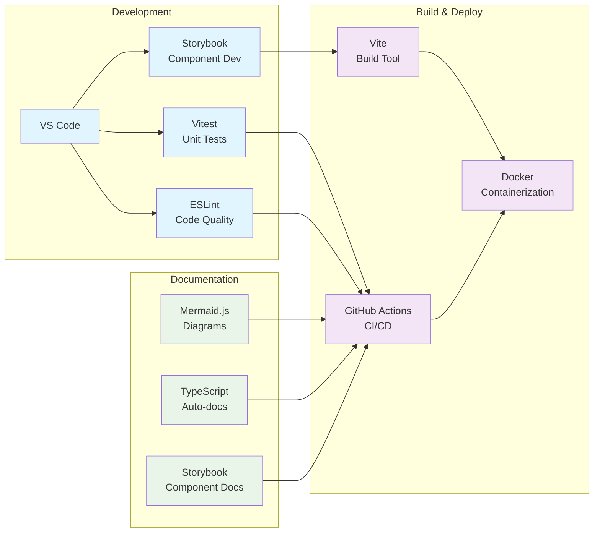

# ModPorter AI - System Architecture Diagrams

This document contains comprehensive visual diagrams explaining the ModPorter AI system architecture and conversion process flow.

## System Architecture Overview

```mermaid
graph TB
    User[👤 User] --> Frontend[⚛️ React Frontend<br/>Vite + TypeScript]
    Frontend --> API[🔌 API Gateway<br/>FastAPI]
    
    API --> Backend[🐍 Backend Service<br/>Python + FastAPI]
    Backend --> AIEngine[🤖 AI Engine<br/>CrewAI + LangChain]
    Backend --> Database[(🗄️ PostgreSQL<br/>Conversion Data)]
    Backend --> Cache[(⚡ Redis<br/>Session Cache)]
    Backend --> FileStorage[📁 File Storage<br/>Conversion Assets]
    
    AIEngine --> JavaAnalyzer[🔍 Java Analyzer<br/>Agent]
    AIEngine --> BedrockArchitect[🏗️ Bedrock Architect<br/>Agent]
    AIEngine --> LogicTranslator[🔄 Logic Translator<br/>Agent]
    AIEngine --> AssetConverter[🎨 Asset Converter<br/>Agent]
    AIEngine --> PackagingAgent[📦 Packaging<br/>Agent]
    AIEngine --> QAValidator[✅ QA Validator<br/>Agent]
    
    LocalAgent[🎮 Local Validation Agent<br/>Node.js] --> MinecraftJava[☕ Minecraft Java]
    LocalAgent --> MinecraftBedrock[🧱 Minecraft Bedrock]
    LocalAgent --> Backend
    
    classDef userClass fill:#e1f5fe
    classDef frontendClass fill:#f3e5f5
    classDef backendClass fill:#e8f5e8
    classDef aiClass fill:#fff3e0
    classDef dataClass fill:#fce4ec
    classDef agentClass fill:#f1f8e9
    
    class User userClass
    class Frontend,API frontendClass
    class Backend backendClass
    class AIEngine,LocalAgent aiClass
    class Database,Cache,FileStorage dataClass
    class JavaAnalyzer,BedrockArchitect,LogicTranslator,AssetConverter,PackagingAgent,QAValidator agentClass
```



## PRD Feature Flow - Conversion Process

```mermaid
flowchart TD
    Start([🚀 User Starts Conversion]) --> Upload{📤 Upload Method?}
    
    Upload -->|File| FileUpload[📁 File Upload<br/>PRD Feature 1]
    Upload -->|URL| URLInput[🔗 URL Input<br/>CurseForge/Modrinth]
    
    FileUpload --> Validate[✅ File Validation<br/>.jar/.zip check]
    URLInput --> Validate
    
    Validate --> |✅ Valid| StartConversion[🔄 Start Conversion<br/>PRD Feature 2]
    Validate --> |❌ Invalid| Error[❌ Show Error Message]
    Error --> Upload
    
    StartConversion --> JavaAnalysis[🔍 Java Analyzer Agent<br/>• Identify assets<br/>• Parse code logic<br/>• Find dependencies<br/>• Categorize features]
    
    JavaAnalysis --> Planning[🏗️ Bedrock Architect Agent<br/>• Map Java → Bedrock<br/>• Apply Smart Assumptions<br/>• Flag incompatible features<br/>• Generate conversion plan]
    
    Planning --> SmartAssumptions{🤖 Smart Assumptions<br/>Required?}
    
    SmartAssumptions -->|Yes| ApplyAssumptions[⚙️ Apply PRD Assumptions<br/>• Custom Dimensions → Structures<br/>• Complex Machinery → Simple Blocks<br/>• Custom GUI → Books/Signs<br/>• Exclude Client Rendering]
    SmartAssumptions -->|No| DirectConversion[🔄 Direct Conversion]
    
    ApplyAssumptions --> LogicTranslation[🔄 Logic Translator Agent<br/>• Java → JavaScript<br/>• OOP → Event-driven<br/>• Comment untranslatable code<br/>• Handle API differences]
    DirectConversion --> LogicTranslation
    
    LogicTranslation --> AssetConversion[🎨 Asset Converter Agent<br/>• Textures → Bedrock format<br/>• Models → Geometry files<br/>• Sounds → Compatible audio<br/>• Organize folder structure]
    
    AssetConversion --> Packaging[📦 Packaging Agent<br/>• Create manifest.json<br/>• Organize file structure<br/>• Generate .mcaddon<br/>• Validate package]
    
    Packaging --> QA[✅ QA Validator Agent<br/>• Check package integrity<br/>• Verify converted features<br/>• Document assumptions<br/>• Generate report]
    
    QA --> Report[📊 Generate Report<br/>PRD Feature 3<br/>• Success/failure summary<br/>• Smart assumptions applied<br/>• Technical details<br/>• Download link]
    
    Report --> ValidationOption{🎮 Run Validation?<br/>PRD Feature 4}
    
    ValidationOption -->|Yes| GameplayValidation[🎮 Gameplay Validation<br/>• Launch both versions<br/>• AI gameplay testing<br/>• Screenshot comparison<br/>• Generate comparison report]
    ValidationOption -->|No| Complete[✅ Conversion Complete]
    
    GameplayValidation --> ValidationReport[📋 Validation Report<br/>• Visual comparison<br/>• Functional differences<br/>• Similarity scores<br/>• Recommendations]
    
    ValidationReport --> Complete
    Complete --> Download[⬇️ User Downloads<br/>.mcaddon file]
    
    classDef startEnd fill:#4caf50,color:#fff
    classDef process fill:#2196f3,color:#fff
    classDef decision fill:#ff9800,color:#fff
    classDef agent fill:#9c27b0,color:#fff
    classDef assumption fill:#f44336,color:#fff
    classDef output fill:#009688,color:#fff
    
    class Start,Complete,Download startEnd
    class FileUpload,URLInput,Validate,StartConversion,LogicTranslation,AssetConversion,Packaging process
    class Upload,SmartAssumptions,ValidationOption decision
    class JavaAnalysis,Planning,QA,GameplayValidation agent
    class ApplyAssumptions assumption
    class Report,ValidationReport,Error output
```



## Smart Assumptions Decision Tree

```mermaid
flowchart TD
    Feature[🔍 Java Feature Detected] --> CheckAPI{🔌 Bedrock API<br/>Available?}
    
    CheckAPI -->|✅ Yes| DirectMap[✅ Direct Mapping<br/>• Blocks → Blocks<br/>• Items → Items<br/>• Basic Recipes → Recipes]
    
    CheckAPI -->|❌ No| FeatureType{🏷️ Feature Type?}
    
    FeatureType -->|🌍 Custom Dimension| DimensionAssumption[🏗️ Dimension → Structure<br/>• Extract biome data<br/>• Convert to large structure<br/>• Place in Overworld/End<br/>• Preserve visual elements]
    
    FeatureType -->|⚙️ Complex Machinery| MachineryAssumption[🔧 Machinery → Simple Block<br/>• Keep model & texture<br/>• Remove power system<br/>• Convert to container/decoration<br/>• Document original function]
    
    FeatureType -->|📱 Custom GUI| GUIAssumption[📖 GUI → Book Interface<br/>• Extract UI elements<br/>• Convert to book pages<br/>• Preserve information access<br/>• Adapt user interaction]
    
    FeatureType -->|🎨 Client Rendering| RenderingAssumption[🚫 Exclude Feature<br/>• Mark as incompatible<br/>• Notify user clearly<br/>• Suggest alternatives<br/>• Document exclusion reason]
    
    FeatureType -->|📚 Mod Dependencies| DependencyCheck{🔗 Dependency<br/>Complexity?}
    
    DependencyCheck -->|Simple| BundleDependency[📦 Bundle Functions<br/>• Extract required functions<br/>• Include in add-on<br/>• Test compatibility<br/>• Document bundling]
    
    DependencyCheck -->|Complex| FlagDependency[🚩 Flag Critical Failure<br/>• Halt conversion<br/>• Explain dependency issue<br/>• Suggest manual porting<br/>• Recommend alternatives]
    
    DirectMap --> Success[✅ Conversion Success<br/>Feature works normally]
    DimensionAssumption --> Partial[⚠️ Partial Success<br/>Functionality changed]
    MachineryAssumption --> Partial
    GUIAssumption --> Partial
    RenderingAssumption --> Excluded[🚫 Feature Excluded<br/>User notified]
    BundleDependency --> Success
    FlagDependency --> Failed[❌ Conversion Failed<br/>Manual intervention needed]
    
    Success --> UpdateReport[📊 Update Report<br/>• Mark as successful<br/>• Document any changes<br/>• Add to converted list]
    
    Partial --> UpdateReport2[📊 Update Report<br/>• Mark as partial<br/>• Document assumptions<br/>• Explain changes to user]
    
    Excluded --> UpdateReport3[📊 Update Report<br/>• Mark as excluded<br/>• Explain why excluded<br/>• Suggest alternatives]
    
    Failed --> UpdateReport4[📊 Update Report<br/>• Mark as failed<br/>• Explain failure reason<br/>• Suggest manual porting]
    
    classDef input fill:#e3f2fd
    classDef decision fill:#fff3e0
    classDef assumption fill:#f3e5f5
    classDef result fill:#e8f5e8
    classDef output fill:#fce4ec
    
    class Feature input
    class CheckAPI,FeatureType,DependencyCheck decision
    class DimensionAssumption,MachineryAssumption,GUIAssumption,RenderingAssumption,BundleDependency,FlagDependency assumption
    class DirectMap,Success,Partial,Excluded,Failed result
    class UpdateReport,UpdateReport2,UpdateReport3,UpdateReport4 output
```



## Component Architecture

```mermaid
graph TB
    subgraph "Frontend Components"
        App[App.tsx]
        ConversionUpload[ConversionUpload.tsx<br/>PRD Feature 1]
        ConversionReport[ConversionReport.tsx<br/>PRD Feature 3]
        ValidationReport[ValidationReport.tsx<br/>PRD Feature 4]
        
        App --> ConversionUpload
        App --> ConversionReport
        App --> ValidationReport
    end
    
    subgraph "API Services"
        APIService[api.ts<br/>HTTP Client]
        TypeDefs[api.ts<br/>TypeScript Types]
        
        ConversionUpload --> APIService
        ConversionReport --> APIService
        ValidationReport --> APIService
        APIService --> TypeDefs
    end
    
    subgraph "Backend Endpoints"
        HealthAPI[/api/v1/health]
        ConvertAPI[/api/v1/convert]
        StatusAPI[/api/v1/convert/{id}/status]
        DownloadAPI[/api/v1/convert/{id}/download]
        
        APIService --> HealthAPI
        APIService --> ConvertAPI
        APIService --> StatusAPI
        APIService --> DownloadAPI
    end
    
    classDef component fill:#e3f2fd
    classDef service fill:#f3e5f5
    classDef endpoint fill:#e8f5e8
    
    class App,ConversionUpload,ConversionReport,ValidationReport component
    class APIService,TypeDefs service
    class HealthAPI,ConvertAPI,StatusAPI,DownloadAPI endpoint
```

## Development Tools Flow



---

*Diagrams generated with Mermaid.js - Visual documentation for ModPorter AI architecture and workflows*