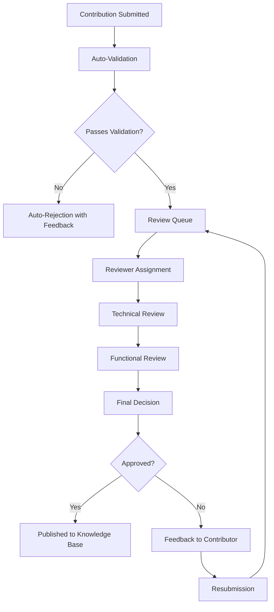

# Community Curation System Documentation

## Overview

The Community Curation System enables collaborative knowledge building and quality assurance for ModPorter-AI's conversion patterns, expert knowledge, and best practices. It provides comprehensive peer review workflows, contribution management, and reputation systems.

## Architecture

### Core Components

1. **Peer Review System** (`backend/src/api/peer_review.py`)
   - Review workflow management
   - Reviewer assignment and expertise matching
   - Quality scoring and analytics

2. **Expert Knowledge Capture** (`backend/src/api/expert_knowledge.py`)
   - Community contribution submission
   - Knowledge validation and extraction
   - AI-powered knowledge enhancement

3. **Version Compatibility Matrix** (`backend/src/api/version_compatibility.py`)
   - Community-sourced compatibility data
   - Migration path discovery
   - Automated testing integration

4. **Conversion Inference Engine** (`backend/src/api/conversion_inference.py`)
   - Machine learning-based conversion prediction
   - Pattern recognition and optimization
   - Performance benchmarking

5. **Community Dashboard** (`frontend/src/components/CommunityContribution/`)
   - Real-time contribution monitoring
   - Review queue management
   - Analytics and insights

## Key Features

### 1. Peer Review Workflow

#### Review Types

| Type | Description | Required Expertise |
|------|-------------|-------------------|
| **Technical Review** | Code quality, architecture, performance | Senior developers |
| **Functional Review** | Feature correctness, edge cases | Domain experts |
| **Security Review** | Security vulnerabilities, best practices | Security specialists |
| **Performance Review** | Optimization opportunities, bottlenecks | Performance experts |

#### Review Process Flow



### 2. Expert Knowledge Capture

#### Contribution Types

1. **Code Patterns**
   - Proven solutions to common problems
   - Best practices and design patterns
   - Performance optimization techniques

2. **Migration Guides**
   - Step-by-step version upgrade instructions
   - Common pitfalls and solutions
   - Tool recommendations

3. **Performance Tips**
   - Optimization strategies
   - Resource usage improvements
   - Benchmarking results

4. **Bug Fixes**
   - Common issue resolutions
   - Workaround strategies
   - Prevention measures

#### Knowledge Extraction Pipeline

```python
# Automatic knowledge extraction from contributions
from backend.src.services.expert_knowledge_capture import KnowledgeExtractor

extractor = KnowledgeExtractor()

# Process new contribution
contribution = {
    "title": "Optimized Block Registration",
    "content": "...",  # Code examples, explanations
    "context": {"mod_type": "forge", "version": "1.19.2"}
}

extracted_knowledge = extractor.extract(contribution)
print("Extracted entities:", extracted_knowledge.entities)
print("Relationships:", extracted_knowledge.relationships)
print("Applicable patterns:", extracted_knowledge.patterns)
```

### 3. Version Compatibility Matrix

#### Community-Sourced Data

The system collects compatibility information from:

- **Automated Testing**: CI/CD pipeline results
- **Community Reports**: User experiences and issues
- **Expert Validation**: Peer-reviewed compatibility data
- **Machine Learning**: Pattern-based predictions

#### Compatibility Scoring

```python
# Compatibility score calculation
def calculate_compatibility_score(source_version, target_version):
    factors = {
        'api_changes': weight=0.4,
        'breaking_changes': weight=0.3,
        'community_reports': weight=0.2,
        'automated_tests': weight=0.1
    }
    
    score = 0
    for factor, weight in factors.items():
        factor_score = evaluate_factor(factor, source_version, target_version)
        score += factor_score * weight
    
    return min(1.0, max(0.0, score))
```

### 4. Conversion Inference Engine

#### Pattern Recognition

The engine learns from successful conversions:

```python
# Conversion pattern learning
from backend.src.services.conversion_inference import ConversionInferenceEngine

engine = ConversionInferenceEngine()

# Learn from successful conversion
conversion_data = {
    "source_code": "...",  # Original Java code
    "target_code": "...",  # Converted code
    "success_metrics": {"accuracy": 0.95, "performance": "good"},
    "manual_interventions": [...]  # Required human corrections
}

engine.learn_from_conversion(conversion_data)

# Predict conversion strategy for new code
prediction = engine.predict_conversion_strategy(new_source_code)
print("Recommended approach:", prediction.strategy)
print("Success probability:", prediction.confidence)
```

## API Reference

### Peer Review Endpoints

#### Submit Contribution
```http
POST /api/expert-knowledge/contributions/
Content-Type: application/json

{
  "contributor_id": "user-123",
  "contribution_type": "code_pattern",
  "title": "Efficient Entity Spawning",
  "description": "Optimized approach to spawning multiple entities",
  "content": {
    "pattern_code": "...",
    "explanation": "...",
    "performance_notes": "..."
  },
  "tags": ["entities", "performance", "spawning"],
  "references": [
    {"type": "documentation", "url": "..."},
    {"type": "example", "mod_id": "example_mod"}
  ]
}
```

#### Get Review Queue
```http
GET /api/peer-review/reviews/queue
?expertise=java_modding
&priority=high
&limit=20
```

#### Submit Review
```http
POST /api/peer-review/reviews/{review_id}/submit
Content-Type: application/json

{
  "reviewer_id": "reviewer-456",
  "technical_review": {
    "score": 8.5,
    "issues_found": ["minor_naming_issue"],
    "suggestions": ["use_more_descriptive_names"]
  },
  "functional_review": {
    "score": 9.0,
    "correctness": "verified",
    "edge_cases": ["handles_null_input"]
  },
  "recommendation": "approve",
  "comments": "Excellent contribution with minor improvements suggested"
}
```

### Expert Knowledge Endpoints

#### Search Contributions
```http
GET /api/expert-knowledge/contributions/search
?query=block_registration
&type=code_pattern
&rating_min=4.0
&verified=true
```

#### Get Domain Summary
```http
GET /api/expert-knowledge/domains/{domain}/summary
```

#### Get Knowledge Recommendations
```http
POST /api/expert-knowledge/recommendations
Content-Type: application/json

{
  "current_task": "creating_custom_block",
  "mod_type": "forge",
  "user_expertise": "intermediate",
  "previous_work": ["item_creation", "basic_blocks"]
}
```

### Version Compatibility Endpoints

#### Get Compatibility Matrix
```http
GET /api/version-compatibility/matrix/
?start_version=1.17.0
&end_version=1.19.2
&include_detailed=true
```

#### Get Migration Path
```http
GET /api/version-compatibility/paths/{source}/{target}
?min_score=0.8
&max_steps=3
&prefer_automated=true
```

#### Submit Compatibility Report
```http
POST /api/version-compatibility/reports/
Content-Type: application/json

{
  "source_version": "1.18.2",
  "target_version": "1.19.2",
  "mod_id": "example_mod",
  "conversion_success": true,
  "issues_encountered": ["texture_mapping"],
  "manual_fixes_required": 2,
  "total_conversion_time": "45 minutes",
  "user_experience": "moderately_difficult"
}
```

### Conversion Inference Endpoints

#### Infer Conversion Path
```http
POST /api/conversion-inference/infer-path/
Content-Type: application/json

{
  "source_mod": {
    "mod_id": "legacy_mod",
    "version": "1.16.5",
    "complexity_indicators": {
      "code_size": 5000,
      "custom_entities": 15,
      "network_handlers": 3
    }
  },
  "target_version": "1.19.2",
  "optimization_goals": ["minimize_breaking_changes", "preserve_functionality"]
}
```

#### Get Conversion Predictions
```http
POST /api/conversion-inference/predict-performance/
Content-Type: application/json

{
  "mod_characteristics": {
    "lines_of_code": 10000,
    "complexity_score": 0.7,
    "custom_content_count": 50
  },
  "conversion_approach": "gradual_migration"
}
```

## Frontend Integration

### Community Dashboard Component

```typescript
import { CommunityContributionDashboard } from '../components/CommunityContribution';

function AdminPanel() {
  return (
    <div>
      <h1>Community Curation</h1>
      <CommunityContributionDashboard
        userRole="admin"
        showAnalytics={true}
        allowedActions={['review', 'approve', 'assign']}
        filters={{
          contributionTypes: ['code_pattern', 'migration_guide'],
          expertDomains: ['java_modding', 'performance']
        }}
      />
    </div>
  );
}
```

### Contributing Form

```typescript
import { ContributionForm } from '../components/CommunityContribution';

function SubmitContribution() {
  const handleSubmit = async (contribution) => {
    try {
      const response = await api.post('/expert-knowledge/contributions/', contribution);
      console.log('Contribution submitted:', response.data);
    } catch (error) {
      console.error('Submission failed:', error);
    }
  };

  return (
    <ContributionForm
      onSubmit={handleSubmit}
      allowedTypes={['code_pattern', 'performance_tip', 'migration_guide']}
      requireReferences={true}
      enablePreview={true}
    />
  );
}
```

## Reputation and Gamification

### Scoring System

| Activity | Points | Multipliers |
|----------|--------|-------------|
| **Contribution Submitted** | 10 base | Quality ×1.5, Complexity ×1.2 |
| **Review Completed** | 5 base | Thoroughness ×1.3, Timeliness ×1.1 |
| **Helpful Review** | +3 | Community rating ×1.4 |
| **Mentoring** | +5 | Mentee success ×1.2 |

### Badge System

| Badge | Requirements | Benefits |
|-------|-------------|----------|
| **Contributor** | 5 approved contributions | Profile highlight |
| **Reviewer** | 20 completed reviews | Priority assignments |
| **Expert** | 50 quality contributions | Admin privileges |
| **Mentor** | Helped 10 newcomers | Special badge |

### Leaderboard Rankings

```typescript
interface ContributorRanking {
  rank: number;
  userId: string;
  username: string;
  score: number;
  contributions: number;
  reviews: number;
  badges: string[];
  specialty: string[];
}

// Usage
const leaderboard = await api.get('/community/leaderboard', {
  params: { period: 'monthly', category: 'overall' }
});
```

## Quality Assurance

### Automated Checks

1. **Code Quality**
   - Syntax validation
   - Style guide compliance
   - Security vulnerability scan

2. **Content Validation**
   - Plagiarism detection
   - Fact checking against known patterns
   - Accuracy verification

3. **Testing Requirements**
   - Code examples must be testable
   - Performance claims require benchmarks
   - Migration guides need validation

### Human Review Process

```python
# Review assignment algorithm
def assign_reviewers(contribution, available_reviewers):
    criteria = {
        'expertise_match': 0.4,
        'availability': 0.2,
        'review_history': 0.2,
        'workload_balance': 0.1,
        'diversity': 0.1
    }
    
    scored_reviewers = []
    for reviewer in available_reviewers:
        score = 0
        for criterion, weight in criteria.items():
            score += evaluate_criterion(criterion, reviewer, contribution) * weight
        scored_reviewers.append((reviewer, score))
    
    return sorted(scored_reviewers, key=lambda x: x[1], reverse=True)[:3]
```

## Analytics and Insights

### Contribution Metrics

```typescript
interface ContributionAnalytics {
  totalContributions: number;
  approvalRate: number;
  averageQuality: number;
  contributionTypes: Record<string, number>;
  topContributors: Array<{
    userId: string;
    contributions: number;
    averageRating: number;
  }>;
  emergingTopics: Array<{
    topic: string;
    growth: number;
    relatedContributions: number;
  }>;
}
```

### Review Efficiency

- **Average Review Time**: Track review completion speed
- **Review Quality**: Assess review thoroughness and accuracy
- **Reviewer Engagement**: Monitor active participation
- **Backlog Analysis**: Identify bottlenecks in review process

### Knowledge Gaps

```python
def identify_knowledge_gaps():
    # Analyze contribution patterns
    coverage_map = analyze_domain_coverage()
    
    # Identify underrepresented areas
    gaps = []
    for domain, coverage in coverage_map.items():
        if coverage < 0.7:  # Less than 70% covered
            gaps.append({
                'domain': domain,
                'coverage': coverage,
                'priority': 'high' if coverage < 0.4 else 'medium'
            })
    
    return sorted(gaps, key=lambda x: x['coverage'])
```

## Performance and Scalability

### Database Optimization

```sql
-- Indexes for efficient queries
CREATE INDEX idx_contributions_type ON contributions(type);
CREATE INDEX idx_contributions_rating ON contributions(rating DESC);
CREATE INDEX idx_reviews_status ON reviews(status, created_at);
CREATE INDEX idx_users_expertise ON users USING GIN(expertise_areas);
```

### Caching Strategy

```python
# Redis caching for frequently accessed data
from redis import Redis
import json

cache = Redis(host='redis', port=6379, db=0)

def get_cached_contributions(filters):
    cache_key = f"contributions:{hash(json.dumps(filters))}"
    cached = cache.get(cache_key)
    
    if cached:
        return json.loads(cached)
    
    # Fetch from database
    contributions = fetch_contributions_from_db(filters)
    
    # Cache for 5 minutes
    cache.setex(cache_key, 300, json.dumps(contributions))
    return contributions
```

### Load Balancing

```yaml
# Docker Compose with load balancing
version: '3.8'
services:
  api:
    image: modporter-ai/api
    deploy:
      replicas: 3
    environment:
      - DATABASE_URL=postgresql://...
      - REDIS_URL=redis://redis:6379
  
  nginx:
    image: nginx
    ports:
      - "80:80"
    volumes:
      - ./nginx.conf:/etc/nginx/nginx.conf
```

## Security Considerations

### Access Control

```python
from functools import wraps
from fastapi import HTTPException, Depends

def require_permission(permission: str):
    def decorator(func):
        @wraps(func)
        async def wrapper(*args, **kwargs):
            user = get_current_user()
            if not user.has_permission(permission):
                raise HTTPException(status_code=403, detail="Insufficient permissions")
            return await func(*args, **kwargs)
        return wrapper
    return decorator

# Usage
@require_permission("approve_contributions")
async def approve_contribution(contribution_id: str):
    # Approval logic
    pass
```

### Content Moderation

```python
# Automated moderation system
class ContentModerator:
    def __init__(self):
        self.filters = [
            self.check_for_spam,
            self.check_for_inappropriate_content,
            self.check_plagiarism,
            self.validate_technical_accuracy
        ]
    
    def moderate_content(self, content):
        results = []
        for filter_func in self.filters:
            result = filter_func(content)
            if result['flagged']:
                results.append(result)
        
        return {
            'approved': len(results) == 0,
            'issues': results,
            'requires_human_review': any(r['severity'] == 'high' for r in results)
        }
```

### Rate Limiting

```python
from slowapi import Limiter, _rate_limit_exceeded_handler
from slowapi.util import get_remote_address

limiter = Limiter(key_func=get_remote_address)

@app.post("/api/expert-knowledge/contributions/")
@limiter.limit("10/minute")  # 10 contributions per minute per user
async def submit_contribution(request: Request, contribution: Contribution):
    # Processing logic
    pass
```

## Testing

### Unit Tests

```bash
# Run all tests
npm run test

# Run specific test suites
npm run test:peer-review
npm run test:expert-knowledge
npm run test:version-compatibility
npm run test:conversion-inference
```

### Integration Tests

```bash
# Test API endpoints
npm run test:integration -- --testNamePattern="CommunityAPI"

# Test frontend components
npm run test:integration -- --testNamePattern="CommunityDashboard"
```

### Performance Tests

```bash
# Load testing for review system
npm run test:load -- --endpoint="reviews/queue" --concurrent=100

# Stress testing for contribution submission
npm run test:stress -- --endpoint="contributions" --rate=50/s
```

## Troubleshooting

### Common Issues

#### Review Queue Backlog

1. Check reviewer availability
2. Adjust assignment criteria
3. Consider temporary reviewer recruitment
4. Automate simple validations

```python
# Monitor review queue health
def check_review_queue_health():
    pending_reviews = get_pending_review_count()
    active_reviewers = get_active_reviewer_count()
    avg_review_time = get_average_review_time()
    
    if pending_reviews > active_reviewers * avg_review_time * 0.8:
        send_alert("Review queue backup detected")
        trigger_emergency_reviewer_recruitment()
```

#### Low Contribution Quality

1. Enhance validation requirements
2. Provide better contribution guidelines
3. Implement mentorship programs
4. Increase review thoroughness

#### Performance Issues

1. Monitor database query performance
2. Implement caching strategies
3. Optimize frontend rendering
4. Consider scaling infrastructure

### Debug Tools

```typescript
// Enable debug mode for community features
const CommunityDebug = {
  enableDebugPanel: true,
  logReviewActions: true,
  trackPerformanceMetrics: true,
  showAssignmentAlgorithm: true
};

// Usage in development
if (process.env.NODE_ENV === 'development') {
  CommunityDebug.enableDebugPanel = true;
}
```

## Future Enhancements

### Planned Features

1. **AI-Powered Review Assistance**
   - Automated review suggestions
   - Quality score prediction
   - Issue detection

2. **Advanced Gamification**
   - Team challenges
   - Skill progression system
   - Achievement badges

3. **Enhanced Analytics**
   - Predictive insights
   - Trend analysis
   - Impact measurement

4. **Integration Improvements**
   - GitHub integration
   - Discord/Slack notifications
   - CI/CD pipeline integration

### Roadmap

- **Q1 2024**: AI assistance, enhanced analytics
- **Q2 2024**: Advanced gamification, mobile app
- **Q3 2024**: External integrations, enterprise features
- **Q4 2024**: Full automation, ML optimization

## Contributing

### Development Setup

```bash
# Clone and setup
git clone https://github.com/modporter-ai/modporter-ai.git
cd modporter-ai

# Install dependencies
npm install
cd backend && pip install -r requirements.txt

# Setup test database
createdb modporter_community_test
python backend/scripts/setup_test_db.py

# Start development
npm run dev
cd backend && python -m uvicorn main:app --reload
```

### Contributing Guidelines

1. **Code Quality**
   - Follow project style guides
   - Write comprehensive tests
   - Update documentation

2. **Community Standards**
   - Be respectful and constructive
   - Provide helpful feedback
   - Mentor newcomers

3. **Review Process**
   - All contributions require review
   - Follow security guidelines
   - Include performance considerations

## License and Support

This component follows the same license as the main ModPorter-AI project.

For support:
- Documentation: [Full API Docs](../API_COMPREHENSIVE.md)
- Issues: [GitHub Issues](https://github.com/modporter-ai/modporter-ai/issues)
- Community: [Discord Server](https://discord.gg/modporter-ai)
- Email: support@modporter-ai.com
